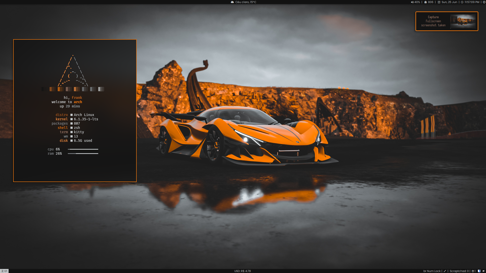
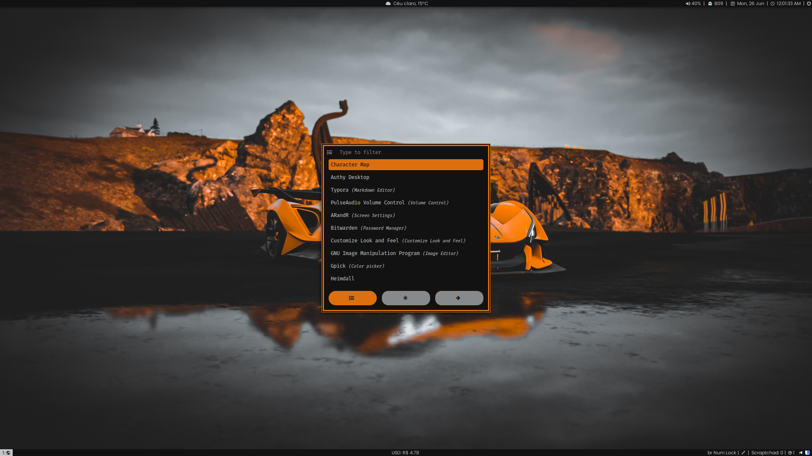

# i3-install.sh

Um script personalizado para minha configuração do i3.

### Antes de usar:
- Lembre-se minha configuração pode ser diferente da sua.
- Leia o script antes de executa-lo.
- NÃO me responsabilizo por nenhum dano.

### Download/Execução:
```sh
curl https://raw.githubusercontent.com/frannks/i3-install/main/i3-install.sh |bash
```

# i3



# Rofi



# i3-Lock


# Links

- [Telegram](https://t.me/FranklinTech)

- [Email](mailto:fraank@riseup.net)
